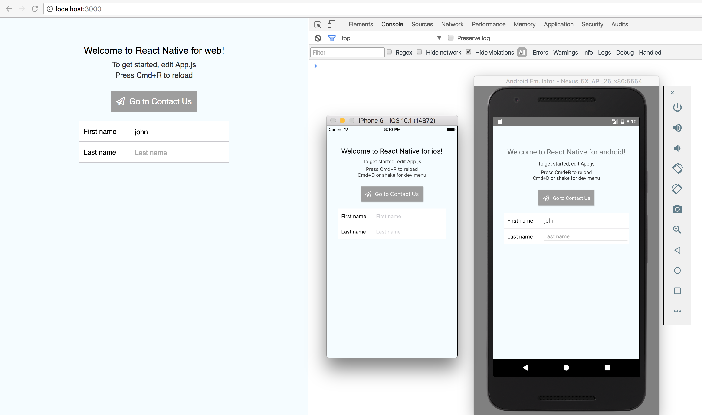
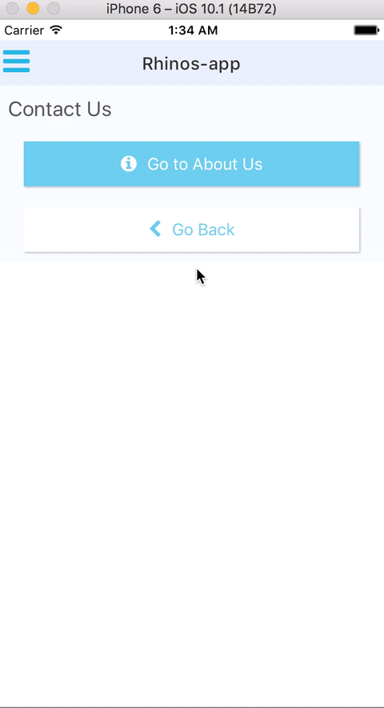

[](https://circleci.com/gh/rhinos-app/rhinos-app-dev)

# Rhinos-app
Rhinos-app is a react-native app which uses [react-native-web](https://github.com/necolas/react-native-web) to achieve cross-platform design. 

[Live Demo: web version](http://45.56.126.43:8300/)

## :star2: FEATURES:
  * :iphone: :computer: Runs on Android, iOS, Web (can also run as a Windows/MacOS/Linux desktop app with [Electron](https://github.com/electron/electron))
  * [SimpleNavigator](app/components/SimpleNavigator/SimpleNavigator.js) with navParams, transition Fx (using Animated)
  * [React-native-gifted-form](https://github.com/FaridSafi/react-native-gifted-form)
  * [React-native-elements](https://github.com/react-native-community/react-native-elements), react-native-vector-icons (FontAwesome), Button, SideMenu, List, etc.
  * Components: React-native-navbar, React-native-tab-view, etc.
  * [Storybook](https://github.com/storybooks/react-storybook): develop & visualize your components interactively.
  * Unit Test: Jest, Enzyme.
  * Miscellaneous features: yarn, ESLint (JS Standard), Webpack, baseStyles.js

*It does not have X, Y, Z libs?* - We adopted [KISS](http://principles-wiki.net/principles:keep_it_simple_stupid) principle but feel free to sprinkle some more pixie dust (Redux, MobX, etc.) to bake your project :)

*Demo video:*
[](https://www.youtube.com/watch?v=tJRVfUz6vbI)



## :book: DOCS:
  * [Deployment](docs/Deployment.md)
  * [Common Issues / Troubleshooting](docs/Troubleshooting.md)

## :package: PREREQUISITES:
  * Android SDK
  * XCode
  * npm global modules:
```
$ npm install -g yarn
$ npm install -g react-native-cli
```

## :wrench: BUILD & RUN:

### Install:
```
$ git clone <URL>
$ cd rhinos-app-dev
$ npm install   (or $ yarn)
```

### Run on Web
```
DEV mode:
  $ npm run web
  
PRODUCTION mode:
  $ npm run build-web
  $ npm run serve-web-background
  
StoryBook:
  $ npm run storybook
```

### Run on Android
  * open Android Emulator
  * in Terminal, make sure you have ANDROID_HOME=/Users/username/Library/Android/sdk
  * run in another Terminal: $ npm start -- --reset-cache

``` 
    $ react-native run-android
``` 

### Run on iOS
  * open iOS Emulator
  * run in another Terminal: $ npm start -- --reset-cache

```    
    $ react-native run-ios
```

## :raised_hands: CONTRIBUTING:
PRs, Stars :star: and Issue Reporting :beetle: are always welcome :)

[](http://standardjs.com)

### Apps built on Rhinos-app
ATVT (Activities) - track influencer's social activities


